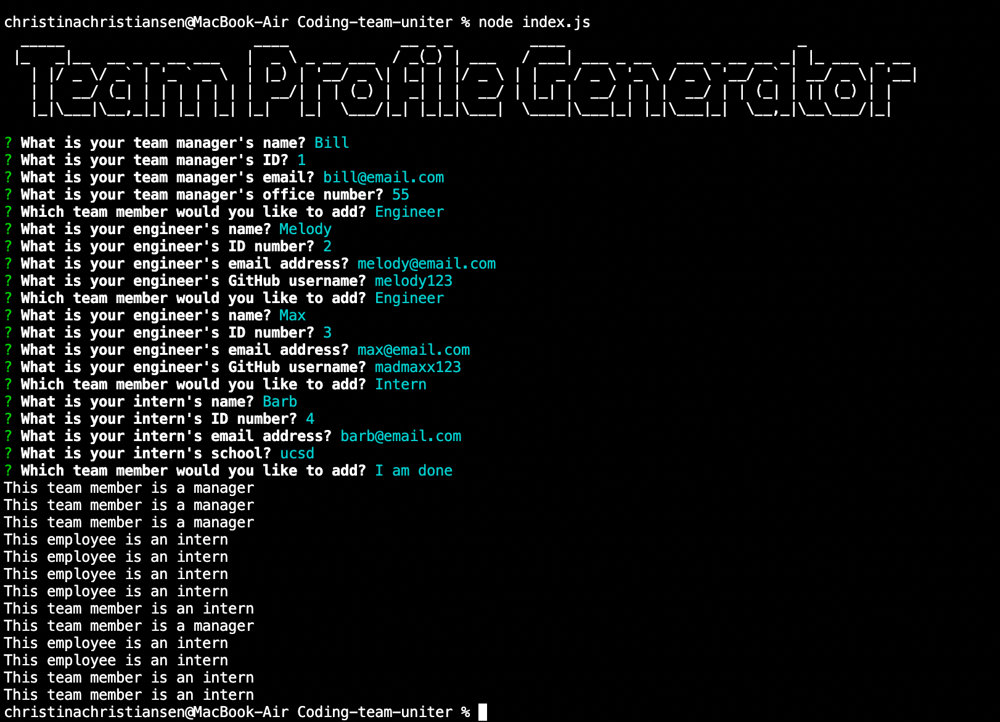
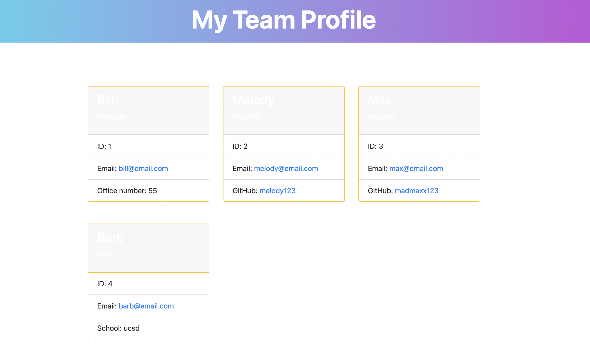

# Coding-team-uniter

## Description

Coding Team Uniter is a Node.js command-line application that generates a styled HTML page for a software engineering team with command line user inputs.

First you will be prompted with questions on adding a team manager followed by the option to add an engineer, intern, or be done adding team members. Depending on your choice- you will then be prompted to enter the information that goes along with that team member. Selecting done will stop asking you prompts and generate your html file based on your inputs in the dist folder.

## Table of Contents

- [Description](#description)
- [Installation](#installation)
- [Usage](#usage)
- [Technology](#technology)
- [Credits](#credits)
- [Assets](#assets)
- [Tests](#tests)

## Installation

- Open the terminal where you have cloned this repo
- Enter the following commands:
  - `npm init -y` - to generate the package.json and package-lock.json
  - `nmp i inquirer` - to install Inquirer
  - `npm i jest` - to install Jest
  - `npm i figlet` - to install Figlet
- Make sure your Repo has the .gitignore file which includes `node_modules` and `.DS_Store` (for macOS) before installing any npm dependencies

## Usage

Type the following commands in terminal: - Run unit tests: `npm test` - Start the app: `node index.js`
Answer the prompts/questions that displayed in your terminal
Select "I have finished adding team members" to stop adding more team member
When you have selected that you are done adding team members- you will no longer be asked prompts and you will see the new team.html file is generated in the `dist/` folder

## Technology

```md
JavaScript
CSS
Node.js
```

## Credits

[npm Inquirer.js](https://www.npmjs.com/package/inquirer), [npm Jest](https://www.npmjs.com/package/jest) and [npm Figlet](https://www.npmjs.com/package/figlet)

- The unit tests are provided by The Coding Boot Camp | UC San Diego Extension | Trilogy Education Services, LLC

## Assets

Link [here] (https://drive.google.com/file/d/1j4ktUD8bCX4-tWocBUgEgp3VTPQa_gKo/view) for walk through video.






## Tests

There are 4 test suites

- Enter `npm test` in terminal to run the tests
